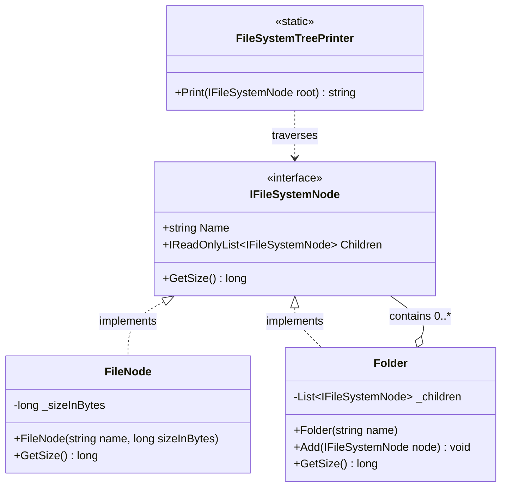

# A14 | Composite Pattern | File-System Size Explorer

## 1. Problem Statement

Treat files and folders uniformly while calculating recursive size and printing a tree.

Minimum requirements: Define one component contract; implement leaf and composite nodes; support nested folders; test totals and traversal.

```c# 
public interface IFileSystemNode 
  { 
    string Name { get; } 
    long GetSize(); 
  } 
  
public sealed class Folder(string name) : IFileSystemNode 
  { 
    private readonly List<IFileSystemNode> children = [];
    public string Name { get; } = name; 
    public long GetSize() => throw new NotImplementedException(); 
    public void Add(IFileSystemNode node) => children.Add(node); 
  }

```

## 2. Design Overview

### 2.1 Component contract

```csharp
public interface IFileSystemNode
{
    string Name { get; }
    IReadOnlyList<IFileSystemNode> Children { get; }
    long GetSize();
}
```

Every node, either leaf of composite, exposes the same three members. A caller never downcasts or type-checks it just calls `GetSize()` or walks `Children`.

### 2.2 Leaf: `FileNode`

A `FileNode` is constructed with a fixed size and no children. Its `GetSize()` simply returns that fixed size, and `Children` is always an empty, read-only list. It is `sealed`, since a file has no meaningful subtype in this context.

### 2.3 Composite: `Folder`

A `Folder` owns a private `List<IFileSystemNode>` of children (each of which may itself be a `FileNode` or another `Folder`). `GetSize()` sums the sizes reported by each direct child; because each child answers `GetSize()` polymorphically, the sum is recursive, a `Folder` never needs to know how deep the tree beneath it goes. `Add` validates against `null` and against a folder being added to itself (which would otherwise create an infinite recursion in `GetSize()`).

This follows the safe variant of the Composite pattern.

`Add` lives only on `Folder`, not on `IFileSystemNode`. A `FileNode` is never forced to implement (or throw from) an `Add` method that makes no sense for it. This keeps every implementation of the contract honest about what it can actually do.

### 2.4 `FileSystemTreePrinter`

A small static class that renders a tree to text (similar to the Windows Powershell's `tree` command). It is kept outside `FileNode`/`Folder` on purpose as printing is a presentation concern, not a domain concern, and thus, it is written entirely against `IFileSystemNode`, so it requires no change if a third kind of node (e.g. a symbolic link) were ever added.
Its own traversal loop is the second demonstration of uniform treatment as it calls `.Children` and `.GetSize()` on every node without ever asking what
concrete type it is.

### 2.5 Class diagram



### 2.6 Worked example

A scratch console app can be created to test the program. For example for the below C# program, the output for the same is pasted below.

```csharp
using System;
using FileSystemComposite;

namespace Scratch
{
    internal static class Program
    {
        private static void Main()
        {
            var root = new Folder("root");
            var documents = new Folder("Documents");
            var reports = new Folder("Reports");

            reports.Add(new FileNode("q1.docx", 500));
            reports.Add(new FileNode("q2.docx", 700));
            documents.Add(reports);
            documents.Add(new FileNode("readme.txt", 20));
            root.Add(documents);
            root.Add(new FileNode("root-file.txt", 30));

            Console.WriteLine(FileSystemTreePrinter.Print(root));
            Console.WriteLine("Total size: " + root.GetSize() + " bytes");
        }
    }
}
```

```text
'-- root (1250 bytes)
    |-- Documents (1220 bytes)
    |   |-- Reports (1200 bytes)
    |   |   |-- q1.docx (500 bytes)
    |   |   '-- q2.docx (700 bytes)
    |   '-- readme.txt (20 bytes)
    '-- root-file.txt (30 bytes)
```

`root.GetSize()` returns `1250` without `root` ever inspecting whether
`Documents` or `Reports` is itself a leaf or a composite.


## 3. Test Summary

| Test class | Focus | Count |
|--- | --- |:-----:|
| `FileNodeTests` | Leaf size/name, empty children, zero-byte file, invalid input | 6 |
| `FolderTests`| Empty/single-level/nested recursive totals, uniform children, `Add` guard clauses, invalid name | 7 |
| `FileSystemTreePrinterTests`| Single-node output, full traversal reaches every node, one line per node | 3 |

Total: 16 tests. 

